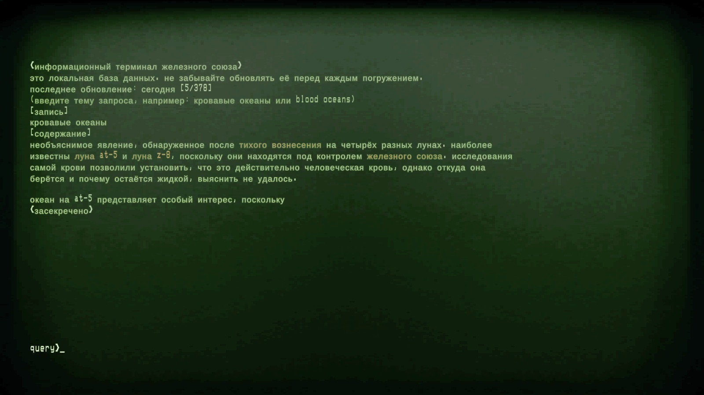

# Русификатор Iron Lung

Полный русский перевод [Iron Lung](https://store.steampowered.com/app/1846170/Iron_Lung/) Дэвида Шимански: меню, настройки, вступление, брифинг, карта, записка, финал, субтитры к голосу по радио и **все 15 статей компьютерного терминала** в подлодке. Запросы в терминале можно вводить **по-русски**.

## Скачать

**[⬇ Скачать IronLung_RUS.zip](https://github.com/enhill/iron-lung-rus/releases/latest/download/IronLung_RUS.zip)** — последняя версия, для Iron Lung 2.3 (Steam). Все версии и список изменений — на странице [Releases](https://github.com/enhill/iron-lung-rus/releases).

## Установка

1. В библиотеке Steam: правой кнопкой по **Iron Lung** → **Управление** → **Просмотреть локальные файлы**.
2. Распакуйте **всё содержимое архива** в открывшуюся папку (папка `BepInEx`, файлы `winhttp.dll`, `doorstop_config.ini`). Файл `winhttp.dll` должен оказаться рядом с `Iron Lung.exe`.
3. Запустите игру. В главном меню должно быть «Новая игра».

**Steam Deck / Linux (Proton):** в свойствах игры → «Параметры запуска» впишите `WINEDLLOVERRIDES="winhttp=n,b" %command%`.

**Удаление:** удалите из папки игры `BepInEx`, `winhttp.dll`, `doorstop_config.ini` и `README_RUS.txt`.

## Терминал

Терминал стоит в задней части подлодки. Введите тему и нажмите Enter: например, `кровавые океаны` или `blood oceans`. Красным в статьях выделены темы, по которым есть отдельная запись. Игра принимает только буквы, цифры и пробелы, поэтому `ат5`, а не «AT-5».

## Что изменено по сравнению с исходным переводом

Этот русификатор основан на переводе **Ниорк Переведун** (версия от 08.10.2024, [ZoneOfGames](https://www.zoneofgames.ru/games/iron_lung/files/9379.html)). В версии 2.0:

**Добавлено**
- перевод компьютерного терминала: все 15 статей базы данных, «неизвестный запрос», ответы на чит-коды (раньше терминал был на английском);
- русские запросы в терминале с падежными формами и подсказка в его заголовке;
- плагин `IronLungRu`: починка шрифта, русские запросы, кнопки меню без переноса.

**Исправлено**
- квадратики вместо части русских букв (не хватало резервного шрифта, переполнялся атлас букв);
- настройки: «Принять» включала инверсию мыши и оконный режим, переключатели вкл/выкл не работали;
- ошибки и неточности во вступлении, брифинге, финале и интерфейсе: «Она не была рассчитан», «вспомогательные элементы управления» вместо пульта управления подлодкой, «траншея» вместо впадины, обрезанные подписи в настройках и т. д.

**Удалено**: 14 неиспользуемых картинок, кэш и лог — архив стал вдвое меньше.

**В версии 2.1:** субтитры к голосу по радио в начале игры, надпись «ГЛУБИНА» на приборной панели вместо DEPTH, записка перерисована в высоком разрешении (текст Ниорка Переведуна).

Подробный список с примерами — в [CHANGELOG.md](CHANGELOG.md).

## Помочь с переводом

Нашли опечатку или знаете, как сказать лучше?

- **Проще всего** — [создайте обращение](https://github.com/enhill/iron-lung-rus/issues/new/choose) по шаблону «Исправление перевода».

## Как устроен перевод

| Папка | Что внутри |
|---|---|
| `package/` | файлы перевода, которые кладутся в папку игры: тексты меню, вступления, брифинга, финала, текстура записки, настройки |
| `src/terminal/` | перевод терминала: по файлу на статью, с оригиналом для сравнения |
| `plugin/` | исходник маленького плагина `IronLungRu`: чинит кириллицу в шрифте, добавляет русские запросы в терминал, показывает субтитры, заменяет текстуры |
| `tools/build.py` | проверяет все файлы и собирает архив: официальные BepInEx и XUnity.AutoTranslator + наш перевод |

Каждое изменение проверяется автоматически, а при выпуске новой версии архив собирается и публикуется сам.

## Авторы

- Игра: **David Szymanski**. Все права на игру и оригинальные тексты принадлежат автору. Перевод любительский и некоммерческий.
- Основа: перевод **Ниорк Переведун**, версия от 08.10.2024 — [ZoneOfGames](https://www.zoneofgames.ru/games/iron_lung/files/9379.html).
- Версия 2.0: доработка перевода, перевод терминала, исправление шрифтов и настроек — Enhill.
- Архив включает [BepInEx](https://github.com/BepInEx/BepInEx) и [XUnity.AutoTranslator](https://github.com/bbepis/XUnity.AutoTranslator) в неизменном виде — см. [THIRD_PARTY.md](THIRD_PARTY.md).
